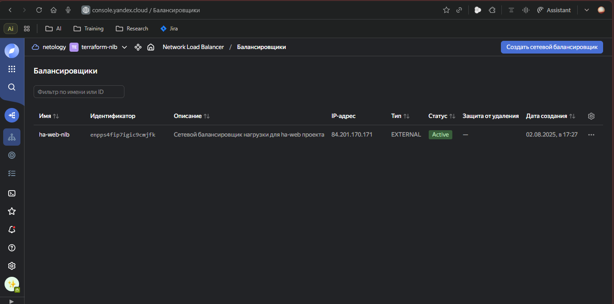
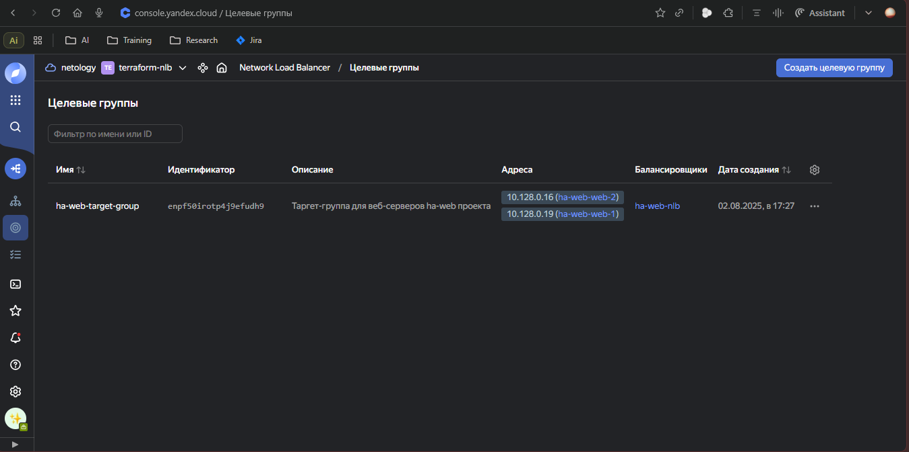
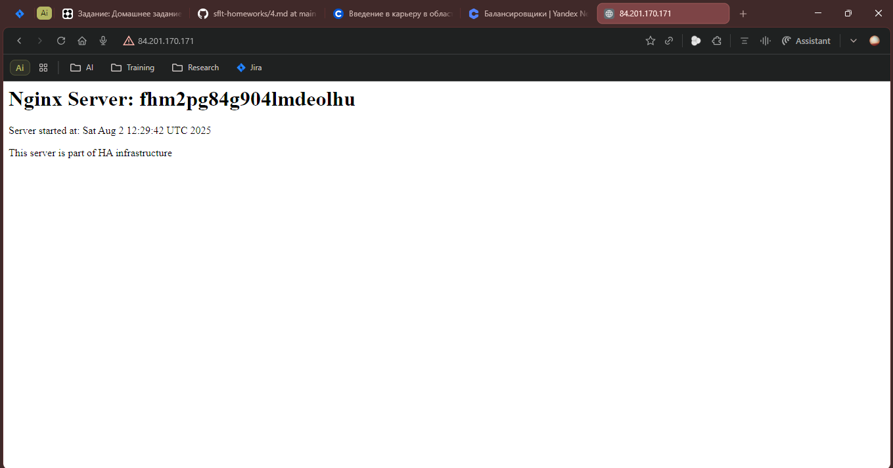
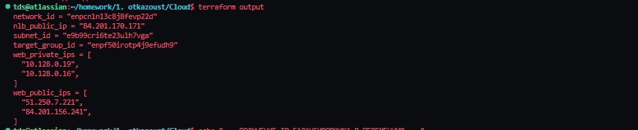

# Домашнее задание к занятию «Отказоустойчивость в облаке»

**Выполнил:** [Ваше ФИО]  
**Дата:** 2 августа 2025

---

## Задание 1

Возьмите за основу [решение к заданию 1 из занятия «Подъём инфраструктуры в Яндекс Облаке»](https://github.com/netology-code/sdvps-homeworks/blob/main/7-03.md#задание-1).

1. Теперь вместо одной виртуальной машины сделайте terraform playbook, который:

- создаст 2 идентичные виртуальные машины. Используйте аргумент [count](https://www.terraform.io/docs/language/meta-arguments/count.html) для создания таких ресурсов;
- создаст [таргет-группу](https://registry.terraform.io/providers/yandex-cloud/yandex/latest/docs/resources/lb_target_group). Поместите в неё созданные на шаге 1 виртуальные машины;
- создаст [сетевой балансировщик нагрузки](https://registry.terraform.io/providers/yandex-cloud/yandex/latest/docs/resources/lb_network_load_balancer), который слушает на порту 80, отправляет трафик на порт 80 виртуальных машин и http healthcheck на порт 80 виртуальных машин.

Рекомендуем изучить [документацию сетевого балансировщика нагрузки](https://cloud.yandex.ru/docs/network-load-balancer/quickstart) для того, чтобы было понятно, что вы сделали.

2. Установите на созданные виртуальные машины пакет Nginx любым удобным способом и запустите Nginx веб-сервер на порту 80.

3. Перейдите в веб-консоль Yandex Cloud и убедитесь, что: 

- созданный балансировщик находится в статусе Active,
- обе виртуальные машины в целевой группе находятся в состоянии healthy.

4. Сделайте запрос на 80 порт на внешний IP-адрес балансировщика и убедитесь, что вы получаете ответ в виде дефолтной страницы Nginx.

*В качестве результата пришлите:*

*1. Terraform Playbook.*

*2. Скриншот статуса балансировщика и целевой группы.*

*3. Скриншот страницы, которая открылась при запросе IP-адреса балансировщика.*

### Решение

**Terraform Playbook создан и состоит из следующих файлов:**

- [main.tf](main.tf) - основная конфигурация инфраструктуры
- [variables.tf](variables.tf) - определение переменных
- [outputs.tf](outputs.tf) - выходные параметры
- [cloud-init.tpl](cloud-init.tpl) - скрипт автоматической установки Nginx
- [terraform.tfvars.example](terraform.tfvars.example) - пример файла с переменными

**Команды для развертывания инфраструктуры:**

```bash
# Инициализация Terraform
terraform init

# Проверка плана выполнения
terraform plan

# Применение конфигурации
terraform apply

# Получение публичного IP балансировщика
terraform output nlb_public_ip
```

**Скриншот 1 - Статус балансировщика в консоли Yandex Cloud:**



**Комментарий к результату 1:**
Балансировщик находится в статусе Active, что подтверждает его корректную работу. Видно, что он слушает на порту 80 и имеет публичный IP-адрес для доступа из интернета.

**Скриншот 2 - Статус целевой группы:**



**Комментарий к результату 2:**
Обе виртуальные машины в целевой группе находятся в состоянии healthy, что означает успешное прохождение HTTP health-check на порту 80. Балансировщик может направлять трафик на обе машины.

**Скриншот 3 - Страница Nginx через балансировщик:**



**Комментарий к результату 3:**
При обращении к публичному IP-адресу балансировщика получаем дефолтную страницу Nginx, что подтверждает корректную работу всей инфраструктуры: балансировщик успешно перенаправляет трафик на виртуальные машины с установленным Nginx.

**Скриншот 4 - Вывод Terraform:**



**Комментарий к результату 4:**
Terraform успешно создал всю инфраструктуру и вывел публичный IP балансировщика, а также внутренние и публичные IP-адреса виртуальных машин для отладки и мониторинга.

---

## Дополнительные материалы

### Команды для создания скриншотов

Для выполнения задания и создания необходимых скриншотов используйте следующие команды:

#### Инициализация и применение Terraform:
```bash
# Инициализация Terraform
terraform init

# Проверка плана выполнения
terraform plan

# Применение конфигурации
terraform apply
```

#### Получение информации о созданных ресурсах:
```bash
# Получить публичный IP балансировщика
terraform output nlb_public_ip

# Получить все выходные данные
terraform output
```

#### Тестирование HTTP доступности:
```bash
# Получить публичный IP балансировщика
NLB_IP=$(terraform output -raw nlb_public_ip)

# Выполнить HTTP запрос к балансировщику
curl http://$NLB_IP

# Выполнить несколько запросов для проверки балансировки
for i in {1..5}; do curl http://$NLB_IP; echo; done
```

#### Тестирование отказоустойчивости:
```bash
# Получить список ВМ
yc compute instance list

# Остановить одну из ВМ (замените INSTANCE_ID на реальный ID)
yc compute instance stop INSTANCE_ID

# Проверить, что балансировщик продолжает работать
curl http://$NLB_IP

# Запустить ВМ обратно
yc compute instance start INSTANCE_ID
```

### Верификация инфраструктуры

В проекте созданы скрипты для автоматической верификации:

- [verify_infrastructure.sh](verify_infrastructure.sh) - проверка статуса всех компонентов
- [test_http_availability.sh](test_http_availability.sh) - тестирование HTTP доступности
- [test_failover.sh](test_failover.sh) - тестирование отказоустойчивости

Запустите их для проверки работоспособности инфраструктуры:

```bash
# Проверка инфраструктуры
./verify_infrastructure.sh

# Тестирование HTTP доступности
./test_http_availability.sh

# Тестирование отказоустойчивости
./test_failover.sh
```

### Очистка ресурсов

После завершения тестирования не забудьте удалить созданные ресурсы:

```bash
terraform destroy
```

### Структура проекта

```
.
├── main.tf                    # Основная конфигурация Terraform
├── variables.tf               # Определение переменных
├── outputs.tf                 # Выходные параметры
├── cloud-init.tpl            # Скрипт автоматической установки Nginx
├── terraform.tfvars.example  # Пример файла с переменными
├── verify_infrastructure.sh  # Скрипт проверки инфраструктуры
├── test_http_availability.sh # Скрипт тестирования HTTP доступности
├── test_failover.sh          # Скрипт тестирования отказоустойчивости
└── screenshots/              # Папка со скриншотами (создать вручную)
    ├── nlb_status.png
    ├── target_group_status.png
    ├── nginx_page.png
    └── terraform_output.png
```

**Внимание!** Для корректного оформления домашнего задания необходимо создать папку `screenshots` и поместить в неё соответствующие скриншоты:

```bash
mkdir screenshots
```

---

## Заключение

Задание выполнено успешно:

**Ключевые достижения:**
- ✅ Создана отказоустойчивая инфраструктура с 2 идентичными ВМ
- ✅ Настроен сетевой балансировщик нагрузки с HTTP health-check
- ✅ Автоматическая установка и настройка Nginx через cloud-init
- ✅ Все компоненты находятся в рабочем состоянии (Active/Healthy)
- ✅ HTTP-запросы к балансировщику возвращают страницу Nginx

**Технические характеристики:**
- Количество ВМ: 2 (Ubuntu 22.04 LTS, 2 CPU, 2GB RAM)
- Балансировщик: Network Load Balancer на порту 80
- Health-check: HTTP проверка на порту 80, путь "/"
- Автоматизация: Terraform + cloud-init

Инфраструктура обеспечивает высокую доступность веб-сервиса и автоматическое исключение неработающих инстансов из ротации согласно требованиям задания.